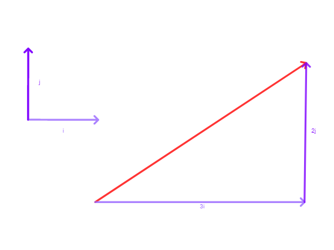
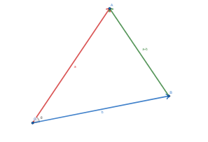
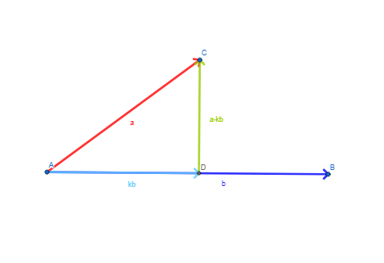
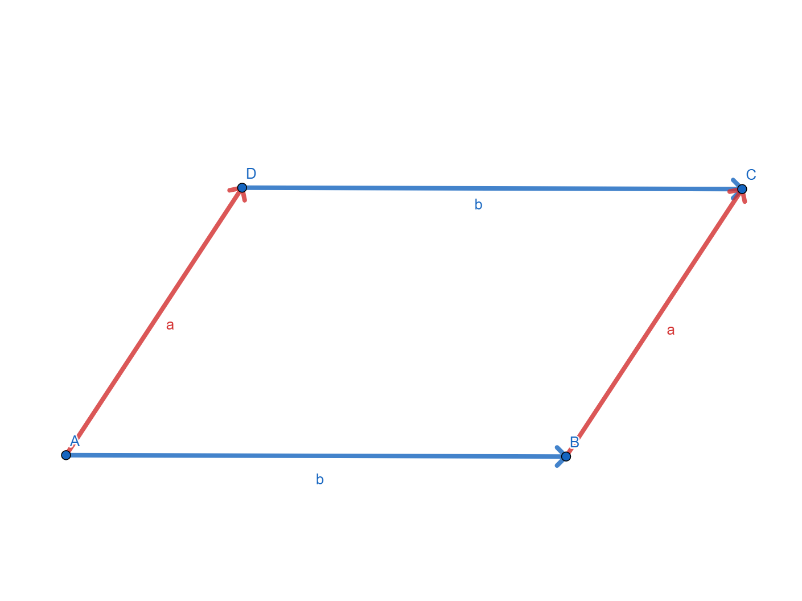
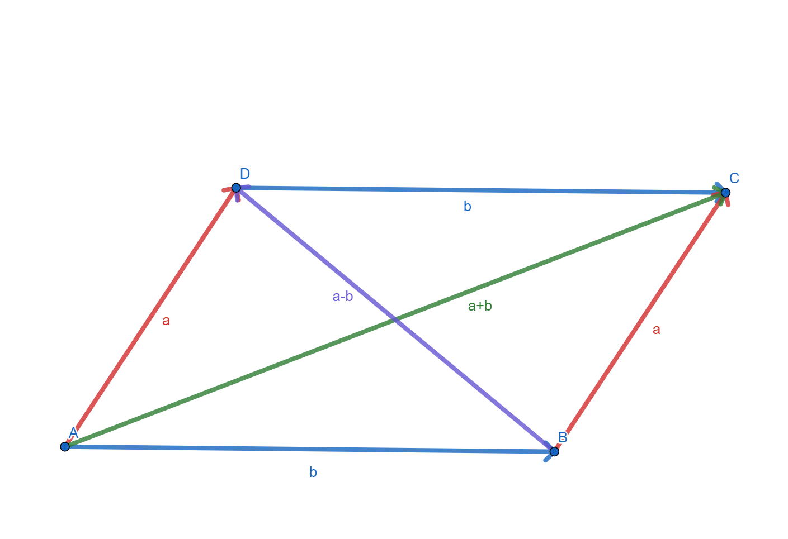
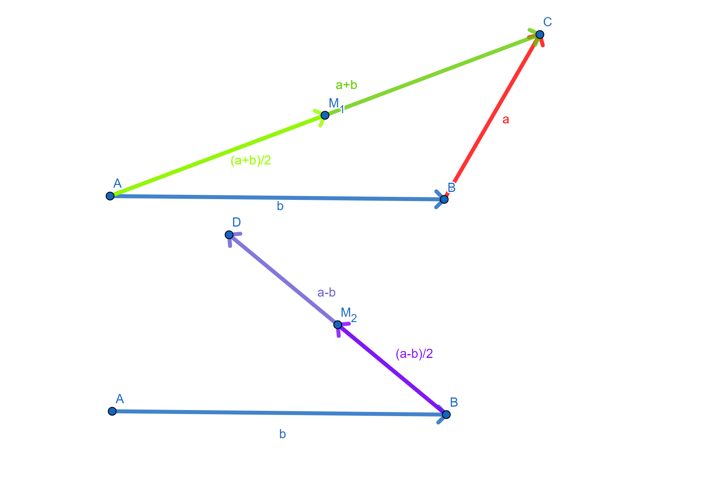
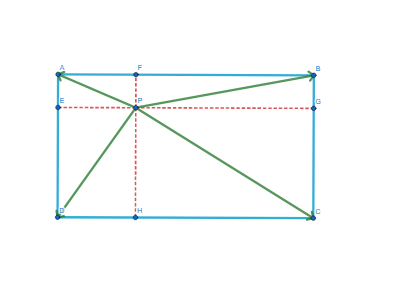
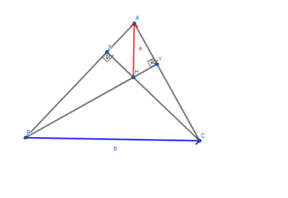

Hey guys these are not done yet but if you want to have a look through feel free anyways lol contact me if anything is wrong/doesn't make sense
## Combinatorics
### Inclusion Exclusion
What is Inclusion Exclusion principle?
Let $n(X)$ represent the number of things in a set, such as red marbles or people in a team.  
**Two variables**
> $n(A)+n(B)-n(A\cap B)=n(A \cup B)$ 

The idea is that we end up counting the objects in $n(A \cap B)$ twice, we have to subtract the extra's at the end to account for this.  
For example,
* There are 219 people doing methods in our year.
* There are 164 people doing english in our year.

If we were to count the number of people in our year who do methods or english (or both), adding these numbers together would give 383 people, which is way more people than in our year!  
This is because we counted everyone who does methods and english (a lot) twice, once in the 219 people who do methods and once in the 164 people doing english. Therefore, to get the correct answer we have to subtract all the people who do both.

**Three variables**
> $n(A)+n(B)+n(C)-n(A\cap B)-n(B\cap C)-n(A\cap C)+n(A \cap B\cap C)=n(A \cup B \cup C)$ 

This is long. Lets work through it logically by seeing which parts we count too many and not enough times.  

Since we add $n(A)$ and $n(B)$, we end up counting all the objects in $n(A\cap B)$ twice, when we should only count them once, so we need to subtract $n(A\cap B)$. Similarly, we need to subtract $n(B\cap C)$ and $n(A\cap C)$ for the same reason.  
Now, considering $n(A \cap B\cap C)$, we count it three times in $n(A),n(B),n(C)$ and subtract it three times in   
$n(A \cap B),n(B \cap C),n(A \cap C)$, so we don't count it at all. Since we need to count it once, we add it once at the end.
### Pascal's Rule
What is Pascals rule?
> Pascals Rule: $\binom{n}{r}+\binom{n}{r+1}=\binom{n+1}{r+1}$. 

Pascals rule is imporant since it relates the binomial coefficients $\binom{n}{r}$ to the numbers in pascals triangle. Here is an optional explanation below of why if you are interested.  
For example, we know that the third row of Pascals triangle (1, 3, 3, 1) can be represented in binomial coeffecients as follows:  
$\binom{3}{0}$, $\binom{3}{1}$, $\binom{3}{2}$, $\binom{3}{3}$  
Now, we know that the next row of Pascals triangle is defined by the sum of the previous, as such. So the 4th row would look like  
$1$, $\binom{3}{0}$ + $\binom{3}{1}$, $\binom{3}{1}$ + $\binom{3}{2}$, $\binom{3}{2}$ + $\binom{3}{3}$, $1$   
However, **using Pascal's rule**, we also know that $\binom{3}{0}$ + $\binom{3}{1}$=$\binom{4}{1}$, $\binom{3}{1}$ + $\binom{3}{2}$=$\binom{3}{1}$ and $\binom{3}{2}$ + $\binom{3}{3}$=$\binom{4}{3}$. Furthermore, since $1=\binom{4}{0}$ and $1=\binom{4}{4}$, the 4th row can be represented as:  
$\binom{4}{0}$, $\binom{4}{1}$, $\binom{4}{2}$, $\binom{4}{3}$, $\binom{4}{4}$  
Here, what i've shown is that if one row can be represented as binomial coeffecients, the next can also. Furthermore, since the first row (1,1) can be represented as $\binom{1}{0}$, $\binom{1}{1}$, it intuitively follows that the second row can be expressed as $\binom{2}{0}$, $\binom{2}{1}$, $\binom{2}{2}$ too, and so on.

**Why might this show up in a test?**  
Because of pascals rule, we can express pascals triangle in terms of binomial coeffecient. That is, the $n^{th}$ row of pascal's triangle is:  
$\binom{n}{0}$, $\binom{n}{1},\dots,\binom{n}{n-1}$, $\binom{n}{n}$  
In a test, the questions they might ask is to ask to to caluculate binomial coefficients from a row of pascals triangle, or for some binomial coeffecient close to another binomial coeffecient. For example:
* Circle $\binom{6}{4}$ on pascals triangle.
* Given that $\binom{9}{3}=84,\binom{9}{4}=126$, what is $\binom{10}{4}$ ?

We can prove pascals rule in two ways as follows, although i don't think we need to know this (it helps for understanding though):

**Algebraic proof:**
$$
\begin{align*}
    \binom{n}{r}+\binom{n}{r+1}&=\frac{n!}{r! \times (n-r)!}+\frac{n!}{(r+1)!(n-r-1)!}\\
    &=\frac{n! \times (r+1)}{(r+1)! \times (n-r)!} + \frac{n! \times (n-r)}{(r+1)! \times (n-r)!}\\
    &=\frac{n! \times (r+1) + n! \times (n-r)}{(r+1)!\times (n-r)!}\\
    &=\frac{n! \times (n+1)}{(r+1)! \times (n-r)!}\\
    &=\frac{(n+1)!}{(r+1)! \times (n-r)!}\\
    &=\binom{n+1}{r+1}
\end{align*}
$$
If you wish to remember this, the best way to do it is to read through it, understand the idea behind it, and then try to derive it yourself with no notes.

**Combinatorial Proof:**

Note that $\binom{n+1}{r+1}$ is the number of ways to choose $n+1$ objects from $r+1$.
So, lets count the number of ways to select $n+1$ objects from $r+1$ objects. Suppose for example we have $n+1$ marbles and we want to select $r+1$ marbles. Lets paint 1 marble red. Then, we can either select this red marble or not select it.
* If we do choose the red marble, then we need to select $r$ more marbles from the remaining $n$, which we have $\binom{n}{r}$ ways of doing.
* If we don't select the red marble, we need to choose $r+1$, from the remaining $n$, which we have $\binom{n}{r+1}$ ways of doing. 
So, adding up the cases where we select the red and don't select the red marble, we have $\binom{n}{r}+\binom{n}{r+1}$ ways of selecting the $r+1$ objects in total, so $\binom{n}{r}+\binom{n}{r+1}=\binom{n+1}{r+1}$.
### Pigeonhole Principle
What is pigeonhole principle?
> If $n+1$ pigeons are placed into $n$ pigeonholes, then 1 pigeonhole must contain at least 2 pigeons.

This principle is easy to prove: assume for a contradiction that each pigeonhole contains at most 1 pigeon - then there are at most $n$ pigeons, a contradiction. This principle is also quite intuitive - how are you giving each pigeon its own pigeonhole if there are more pigeons than pigeonholes?  
This principle can be extended as well as follows:
> If $an+1$ pigeons are placed into $n$ pigeonholes, 1 pigeonhole must contain at least $a+1$ pigeons.

Again, a similar proof by contradiction works for this - if each pigeonhole contains at most $a$ pigeons, then theres at most $an$ pigeons, a contradiction.  
Although this principle is rather easy to understand, the difficult part is finding out what should be our pigeons and what should be our pigeon holes.

Here are two examples to illustrate how i would approached these problems and my thought process. With practice, you can spot the idea immediately. 

**Problem 1:**  
 There are 35 players on a football team and each player has a different number chosen from 1 to 100. Prove that there are at least four pairs of players whose numbers have the same sum. 

 Here, we want to show that there are pairs of players with the same sum. So, if our pigeonholes are the number of sums, and the number of pairs of players as our pigeons, then by pigeonhole principle we can probably find pairs of players in the with the same sum (i.e. in the same pigeonhole). Therefore, all that is left is to calculate the numbers. Here is how I would write it:

 Let the pairs of players be our pigeons, and the possible sums of the players numbers be our pigeonholes. Therefore, we have $\binom{35}{2}=595$ pigeons. Since the smallest sum is 3 and the largest 199, there are 197 different sums, so 197 pigeonholes. Therefore, since $197 \times 3 + 1= 592 < 595$, one of the pigeonholes has to have at least 4 pigeons, so there do exist 4 pairs with the same sum.

 **Problem 2**  
Seven boys and five girls sit evenly spaced at a round table. Prove that some pair of
boys are sitting opposite each other.  
What does it mean for two boys to be sitting opposite to to each other? Well, it means that if i take two people opposite each other they contain two boys. So, having our pigeons be boys at the table and pigeonholes be the 6 groups of opposite chairs seems like it could work. To clarify, suppose that each person is sitting on a number on a clock face. Our pigeonholes would be seats (12 and 6), (1 and 7), (2 and 8), and so on, where each pigeonhole has two seats opposite each other. Then, since there are 7 pigeons (boys) and 6 pigeonholes (groups of seats), 2 boys must be in the same group of seats, so there must be two boys sitting opposite each other. 

### Selections
1### How to use case bash
Some combinatorics problems you just have to break into cases
## Vectors
### Definition
For our purposes, a vector is a line segment with direction and magnitude. We can represent a vector this way, listing its magnitude and direction as such: $3$  $\angle 135^\circ$ (polar form). However, we can also represent a vector as its vertical part and its horizontal part, which we call component form, like $\binom{a}{b} = ai + bj$. For example, the vector $\underset{\tilde{}}{a}=\binom{3}{2}$ can be represented as the sum of 3 i vectors and 2 j vectors as such:
  
### Arithmetic
We can add two vectors together as such:
>$\vec{AX}+\vec{XB}=\vec{AB}$
> 
>$\binom{a_1}{b_1}+\binom{a_2}{b_2}=\binom{a_1+a_2}{b_1+b_2}$

See how the $X$ just cancels out? Recognising this pattern makes it much easier to add vectors - just remove the two X's and the plus sign!
Graphically, we use "head to tail" method, where we line up the vectors head to tail. 
If you think about it hard enough, lining up the vectors this way, the resulting vector will have components the sum of the previous ones, just as we wanted.
  
Subtraction in a very similar way - think about it in terms of addition. $\vec{AB}-\vec{AX}=\vec{AB}+\vec{XA}=\vec{XA}+\vec{AB}=\vec{XB}$
> $\vec{AB}-\vec{AX}=\vec{XB}$
>
>$\binom{a_1}{b_1}-\binom{a_2}{b_2}=\binom{a_1-a_2}{b_1-b_2}$

What about multiplication (and by extension division)? Well, we can't multiply two vectors together, but we can do something similar. We can scale up or down vectors by some number $k$ as such:
> $k\binom{a_1}{b_1}=\binom{ka_1}{kb_1}$

Think about it as a vector with the same direction but a length k times longer. We also call a vector with length 1 a unit vector, and give it a hat. The unit vector of $\underset{\tilde{}}{a}$ is the vector in the same direction with length one, represented by $\frac{\underset{\tilde{}}{a}}{||\underset{\tilde{}}{a}||}$.  
The other operation that we can do is called the "dot product". 
> $\binom{a_1}{b_1} \cdot \binom{a_2}{b_2}=a_1 \times a_2 + b_1 \times b_2$

Look at cos with vectors for some more information...
Now, expressing the dot product in terms of vectors is incredibly useful for a lot of reasons. The dot product is very similar to normal multiplication:
>$(\underset{\tilde{}}{a}+\underset{\tilde{}}{b})\cdot \underset{\tilde{}}{c}=\underset{\tilde{}}{a}\cdot \underset{\tilde{}}{c} + \underset{\tilde{}}{b}\cdot \underset{\tilde{}}{c}$
>
>$$||\underset{\tilde{}}{a}||^2 = \underset{\tilde{}}{a}\cdot \underset{\tilde{}}{a}$$

The first rule allows you to expand vectors with dot product incredibly easily, and the second lets you relate it to lengths. These are very easy to prove, let:  
$\underset{\tilde{}}{a}=\binom{a_1}{b_1}$, $\underset{\tilde{}}{b}=\binom{a_2}{b_2}$, $\underset{\tilde{}}{c}=\binom{a_3}{b_3}$.
Therefore, $$\begin{align*}
(\underset{\tilde{}}{a}+\underset{\tilde{}}{b})\cdot \underset{\tilde{}}{c}&=\left(\binom{a_1}{b_1}+\binom{a_2}{b_2}\right)\cdot \binom{a_3}{b_3}\\
&=\binom{a_1+a_2}{b_1+b_2}\cdot \binom{a_3}{b_3}\\
&=(a_1+a_2)\times a_3+(b_1+b_2)\times b_3\\
&=a_1a_3+b_1b_3+a_2a_3+b_2b_3\\
&=\underset{\tilde{}}{a}\cdot \underset{\tilde{}}{c}+ \underset{\tilde{}}{b}\cdot \underset{\tilde{}}{c}
\end{align*}$$
For the second one, $\underset{\tilde{}}{a}\cdot \underset{\tilde{}}{a} = a_1^2 + b_1^2= \sqrt{a_1^2 + b_1^2}^2=||\underset{\tilde{}}{a}||^2$.

### Cos with vectors and dot product
> $a\cdot b=||a|| \times ||b|| \times cos\theta$

  
You've probably seen this before. Here is a proof.

Suppose we have a triangle $OAB$ with $\angle AOB=\theta$. For convenience, let $a=\vec{OA}$, $b=\vec{OB}$ (i'm emitting the squiggly lines so my writeup doesn't suck you should include them).  
Therefore, we have 
$$\begin{align*}
||\vec{BA}||^2&=||a||^2+||b||^2 - 2 \times ||a||\times||b||\times cos{\theta}\\
||a-b||&=||a||^2+||b||^2 - 2 \times ||a||\times||b||\times cos{\theta}\\
||a||^2+||b||^2-2a\cdot b&=||a||^2+||b||^2 - 2 \times ||a||\times||b||\times cos{\theta}\\
-2a\cdot b&=- 2 \times ||a||\times||b||\times cos{\theta}\\
a\cdot b&=||a|| \times ||b|| \times cos\theta
\end{align*}$$

This is useful for many reasons, such as relating dot product and lengths to the angle, and for perpendicular vectors. 
### Parallel and Perpendicular vectors
>$k\underset{\tilde{}}{a}=\underset{\tilde{}}{b}$ if and only if $\underset{\tilde{}}{a}$ and $\underset{\tilde{}}{b}$ are parallel
>
>$\underset{\tilde{}}{a}$ and $\underset{\tilde{}}{b}$ are perpendicular if and only if $\underset{\tilde{}}{a}\cdot \underset{\tilde{}}{b}=0$

Parallel vectors are simple: two vectors being parallel is equivelent to one being a multiple of another. So, if you can find some number k such that $k\underset{\tilde{}}{a}=\underset{\tilde{}}{b}$, $\underset{\tilde{}}{a}$ and $\underset{\tilde{}}{b}$ are parallel. ($k$ can be negative)

My explanation for this is as follows: Since vectors have no position, if they are parallel you can put them so they both start at the origin. Since they both have the same direction since they are parallel, the only thing that differs is their magnitude. If we scale this up or down (multiply by a number) so they have the same magnitude, they will be the same vector.

From before, if $\underset{\tilde{}}{a}$ and $\underset{\tilde{}}{b}$ are perpendicular, then $cos\theta=cos90=0$, so $\underset{\tilde{}}{a}\cdot \underset{\tilde{}}{b}=0$. Similarly, if the dot product is 0, either one of your vectors is the 0 vector or they are perpendicular. We use this result quite often in proofs, so don't forget it!

### Vector + Scalar Resolute
> Vector Resolute is: $\frac{\underset{\tilde{}}{a}\cdot \underset{\tilde{}}{b}}{||\underset{\tilde{}}{b}||^2}=\underset{\tilde{}}{a}\cdot \underset{\tilde{}}{\hat{b}} \times \underset{\tilde{}}{\hat{b}}=||\underset{\tilde{}}{a}||cos(\theta) \underset{\tilde{}}{\hat{b}}$
>
>Scalar Resolute is: $\underset{\tilde{}}{a}\cdot \underset{\tilde{}}{\hat{b}}=||\underset{\tilde{}}{a}||cos(\theta)$

The vector resolute is like if u looked at the shadow a vector put on another vector. The scalar resolute is just the length of the vector resolute. Here's a diagram:
  
Here, the vector resolute of $\underset{\tilde{}}{a}$ on $\underset{\tilde{}}{b}$ is $k\underset{\tilde{}}{b}$. 
We know that $\underset{\tilde{}}{a}-k\underset{\tilde{}}{b}$ and $\underset{\tilde{}}{b}$ are perpendicular, so:
$$\begin{align*}
0&=(\underset{\tilde{}}{a}-k\underset{\tilde{}}{b})\cdot \underset{\tilde{}}{b}\\
&=\underset{\tilde{}}{a}\cdot \underset{\tilde{}}{b} - k \underset{\tilde{}}{b}\cdot \underset{\tilde{}}{b}\\
k||\underset{\tilde{}}{b}||^2&=\underset{\tilde{}}{a}\cdot \underset{\tilde{}}{b}\\
k&=\frac{\underset{\tilde{}}{a}\cdot \underset{\tilde{}}{b}}{||\underset{\tilde{}}{b}||^2}\\
k\underset{\tilde{}}{b}&=\frac{\underset{\tilde{}}{a}\cdot \underset{\tilde{}}{b}\times \underset{\tilde{}}{b}}{||\underset{\tilde{}}{b}||^2}\\
&=\underset{\tilde{}}{a}\cdot \underset{\tilde{}}{\hat{b}} \times \underset{\tilde{}}{\hat{b}}\\
&=\frac{||\underset{\tilde{}}{a}||\times ||\underset{\tilde{}}{b}||\times cos(\theta) \underset{\tilde{}}{b}}{||\underset{\tilde{}}{b}||^2}=||\underset{\tilde{}}{a}||cos(\theta) \underset{\tilde{}}{\hat{b}}
\end{align*}$$
Dividing by $\underset{\tilde{}}{\hat{b}}$ eliminates the "direction" and gives the scalar resolute.
### Proofs
Note that i've tried to include all the arithmetic steps to make it easier to understand, and you can probably get away with not doing that, although if you can its a good idea to demonstrate the arithmetic.

Just a warning for your proofs:
($LHS$ = left hand side, $RHS$ = right hand side).
>If you are required to prove $LHS=RHS$, start with $LHS$ and work with it until you get $RHS$. Don't start with $LHS=RHS$ and go to $0=0$, as unless you are very careful it is not valid!

The reason I say this is because just because you can follow the logic down, doesn't mean you can follow the logic up. $LHS = RHS \implies 0=0$ doesn't mean that $0=0 \implies LHS = RHS$! For example, multiplying everything by zero gives $0=0$. It is only ok to do this if the logic "goes both ways", or in other words the operation can be reversed. For example, multiplying by zero or squaring (because of negative numbers) cannot be easily reversed, but adding or subtracting can. Be careful!

**Problem 1:**
Show that the diagonals of a parallelogram bisect each other.  

As always, we draw a diagram first. Note that i dunno how to place the little squiggly line under variables in the diagrams, so they are omitted (pretend they have squiggly lines underneath them).
  
Since we are dealing with a parallelogram, the red vectors are the same, and the blue vectors are the same. Furthermore, we are dealing with diagonals, so lets draw those in.  
  
Now, a useful approach to this question is to show that the two midpoints of the purple and green vectors are the same point. So, lets define the midpoints of $AC$ and $BD$ as $M_1$ and $M_2$. Furthermore, lets represent them in terms of $\underset{\tilde{}}{a}$ and $\underset{\tilde{}}{a}$.  
  
Here, we have $\vec{AM_1}=\frac{1}{2}\vec{AC}=\frac{{\underset{\tilde{}}{a}+\underset{\tilde{}}{b}}}{2}$.  
Furthermore, $\vec{AM_2}=\vec{AB}+\vec{BM_2}=\underset{\tilde{}}{b}+\frac{{\underset{\tilde{}}{a}}-\underset{\tilde{}}{b}}{2}=\frac{\underset{\tilde{}}{a}+\underset{\tilde{}}{b}}{2}$.  
Therefore, $\vec{AM_1}=\vec{AM_2}$, so $M_1$ is the same point as $M_2$ and therefore the intersection of the lines is a midpoint to both lines, so the diagonals bisect each other.
Here is a formal proof:

**Problem 2:**  
Let $ABCD$ be a rectangle, and $P$ a point inside the rectangle. Show that $AP^2+CP^2=BP^2+DP^2$. 

Since we are using vector methods, we should represent this equation in vectors: $||\vec{PA}||^2+||\vec{PC}||^2=||\vec{PB}||^2+||\vec{PD}||^2$
We should start every problem by drawing a diagram.
  
Here, there are two methods to do this - one is pythagoras, where i wont write anything out in vectors but you can write everything as lengths of vectors and components. The second proof is purely vector methods without any pythagoras, and doesn't require the red lines.

**Proof 1:** Pythagoras.

Draw in the red lines so they are perpendicular to the sides of the rectangle. Notice that we now have a bunch of right angled triangles (for example AFP). So, we have (using lengths not vectors)
$$\begin{align*}
PA^2+PC^2&=AF^2+FP^2+PH^2+HC^2\\
\text{Since }& AF=DH, BF=HC,\\
&=DH^2+PH^2+FP^2+BF^2\\
&=PD^2+PB^2
\end{align*}$$
So we are done. To use vector methods, just express the vectors in terms of components, $PA$ in terms of $AF+FP$.

**Proof 2:** Dot product.

First, we will show $\vec{PA}\cdot \vec{PC}=\vec{PB}\cdot \vec{PD}$.

$$\begin{align*}
\vec{PA}\cdot \vec{PC}&=(\vec{PB}+\vec{BA})\cdot (\vec{PD}+\vec{DC})\\
&=(\vec{PB}+\vec{BA})\cdot (\vec{PD}-\vec{BA}) \text{ since } \vec{DC}=-\vec{BA}\\
&=\vec{PB}\cdot \vec{PD} - \vec{BA}\cdot \vec{PB} + \vec{BA}\cdot \vec{PD} - \vec{BA}\cdot \vec{BA}\\
&=\vec{PB}\cdot \vec{PD} +\vec{BA} \cdot (\vec{PD}-\vec{PB}-\vec{BA})\\
&=\vec{PB}\cdot \vec{PD} +\vec{BA} \cdot (\vec{PD}+\vec{BP}+\vec{AB})\\
&=\vec{PB}\cdot \vec{PD} +\vec{BA} \cdot (\vec{AB}+\vec{BP}+\vec{PD})\\
&=\vec{PB}\cdot \vec{PD} +\vec{BA} \cdot \vec{AD}\\
&=\vec{PB}\cdot \vec{PD} \text{ since $BA$ is perpendicular to AD.}
\end{align*}$$
So we've shown that $\vec{PA}\cdot \vec{PC}=\vec{PB}\cdot \vec{PD}$. Call this equation _(1), we will use it later. Therefore:
$$\begin{align*}
||\vec{PA}||^2+||\vec{PC}||^2&=||\vec{AP}||^2+||\vec{PC}||^2\\
&=||\vec{AP}+\vec{PC}||^2-2\vec{AP}\cdot \vec{PC}\\
&=||\vec{AC}||^2+2\vec{PA}\cdot {PC}\\
&=||\vec{BD}||^2+2\vec{PB}\cdot \vec{PD} \text{ since }||AC||=||BD|| \text{ and equation (1)}\\
&=||\vec{BP}+\vec{PD}||^2-2\vec{BP}\cdot \vec{PD}\\
&=||BP||^2+||PD||^2\\
&=||PB||^2+||PD||^2
\end{align*}$$
So we are done.

**Problem 3:**  
Show that the orthocentre exists - i.e. the altitudes of a triangle meet at at a point. 

An altitude is a line that is perpendicular to a side and touches the opposite vertex of the triangle. Lets draw a diagram.

  

Here, i've drawn in two of the altitudes, and the line from the vertex to their intersection point. If this vector is perpendicular to the blue vector, the side, then the red line is an altitude and therefore the 3 altitudes intersect at a point, which is what we want. With perpendicular vectors, we usually show the dot product is 0. So,

$$\begin{align*}
\underset{\tilde{}}{a}\cdot \underset{\tilde{}}{b}&=\underset{\tilde{}}{a}\cdot (\vec{BH}+\vec{HC})\\
&=\underset{\tilde{}}{a}\cdot \vec{BH} + \underset{\tilde{}}{a}\cdot \vec{HC}\\
&=(\vec{HC}+\vec{CA})\cdot \vec{BH} + (\vec{HB}+\vec{BA})\cdot \vec{HC}\\
&=\vec{HC}\cdot \vec{BH} + \vec{CA}\cdot \vec{BH} + \vec{HB}\cdot \vec{HC} + \vec{BA}\cdot \vec{HC}\\
\text{Since $BH$ and $AC$ are perpendicular, } \vec{BH}\cdot \vec{AC} &= 0\\
\text{Similarly, } \vec{HC}\cdot \vec{BA} &= 0\\
\therefore \underset{\tilde{}}{a}\cdot \underset{\tilde{}}{b}&=\vec{HC}\cdot \vec{BH} + \vec{HB}\cdot \vec{HC}\\
&=\vec{HC}\cdot \vec{BH} - \vec{BH}\cdot \vec{HC}\\
&=0
\end{align*}$$
So they are perpendicular and we are done.
<!---
needs fixing
-->